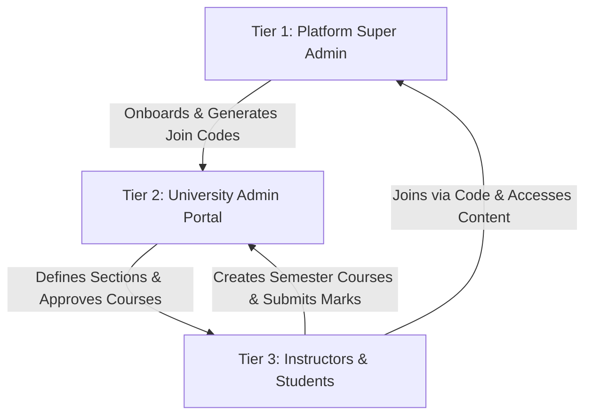

# EduForge: Comprehensive Interview & Project Guide

EduForge is a modern, monorepo-based learning management and academic tracking platform. It is designed to scale from a public, self-paced learning space to a highly isolated, structured institutional university environment with advanced project collaboration tracking and a real-time synchronous examination engine.

---

## 🚀 1. Technology Stack
*   **Frontend (Apps):** React (Vite, Tailwind CSS, Context API, WebSockets, HTML5, Custom CSS).
*   **Backend (Services):** Spring Boot (Java 17, Spring Security + JWT, Spring Data JPA, WebSocket server, Task Scheduling, Maven).
*   **Database:** JPA/Hibernate-managed relational database (MySQL/PostgreSQL compatible).
*   **AI Integration:** Gemini AI API (integrated for automated course outline creation, quiz generation, project summary extraction, and marks sheets analysis).
*   **APIs & integrations:** GitHub REST API (for repository activity, commit-level logs, pull request tracking, and collaborator contribution analysis).

---

## 🏛️ 2. Architectural Design: 3-Tier Institutional RBAC
To serve both public learners and universities, the system implements a strict three-tier role-based access control (RBAC) hierarchy across isolated web applications:



*   **Tier 1: Platform Super Admin (`apps/admin`)**
    *   Verifies, onboard/offboards, or blocks global instructors on the public platform.
    *   Creates university instances, sets up Tier 2 university admin credentials, generates unique, time-sensitive **University Join Codes**, and monitors system-wide audit logs.
*   **Tier 2: University Admin Portal (`apps/uni-admin` - Standalone App)**
    *   Manages academic structures: Branches, Sections, and Academic Years.
    *   Curates the course pool by reviewing, approving, or rejecting course proposals submitted by instructors.
    *   Allocates approved courses to specific Section-Branch student groups for a semester, triggering automated student enrollment.
    *   Reviews, approves, or returns submitted Final Marks Sheets, and archives certified records.
*   **Tier 3: Instructors & Students (`apps/web` - Shared portal with view isolation)**
    *   Joined via University Join Codes to unlock isolated "University Space" modules.
    *   **Instructors:** Build curriculum, set deadline-penalty rules, orchestrate live tests, monitor student GitHub metrics, and prepare final grades.
    *   **Students:** Participate in interactive players, attempt live tests, view live grading breakdowns, collaborate on projects, and earn verifiable certificates.

---

## 🌐 3. Public Space vs. University Space

### 🟢 The Public Space (Self-Paced Learning)
*   **Audience:** Global, independent learners and certified public instructors.
*   **Onboarding:** Public sign-up. Instructors enter a secure **"Waiting Room"** until verified by the Tier 1 Platform Admin to prevent platform abuse.
*   **Workflow:**
    1. Approved instructors create public courses, upload text/video content, and create quizzes.
    2. Any registered student can explore the public course marketplace, enroll, and learn at their own pace.
    3. Basic communication channels exist (e.g., student-to-instructor messaging).

### 🔵 The University Space (Isolated Institutional Network)
*   **Audience:** Verified students, instructors, and academic administrators belonging to a specific university.
*   **Onboarding:** Users input a unique **University Join Code** generated by the Tier 1 Admin. Upon submission, they are associated with the university context. Students are mapped to their specific Branch, Section, and Academic Year.
*   **Workflow:**
    1. **Course Pool Submission:** Instructors design semester courses. Instead of publishing directly, these are submitted to the **University Course Pool** for review.
    2. **Approval & Allocation:** The Tier 2 University Admin reviews the course structure. Once approved, the admin allocates the course to a specific student Section (e.g., *Computer Science - Section A - Year 3*) and sets a semester deadline.
    3. **Automated Group Enrollment:** On allocation, the system automatically enrolls all students belonging to the target section in the course.
    4. **Isolated Experience:** The allocated course material, internal forums, and gradebooks are strictly hidden from public view and visible *only* to the allocated section's students and assigned instructor.

---

## 💻 4. Dedicated Project Space & GitHub Integration
One of the most novel features of EduForge is the student project tracking module, which prevents "free-riding" in group projects by monitoring individual performance using Git metrics.

```
+-----------------------------------------------------------------+
|                         PROJECT SPACE                           |
+-----------------------------------------------------------------+
|                                                                 |
|   Selective/Random Grouping  ==>  Repo Creation via GitHub API   |
|                                                                 |
|   Real-Time Monitoring       ==>  PRs, Branch snapshots, Commits|
|                                                                 |
|   Instructor Analytics       ==>  Git Activity Tree, Timelines   |
|                                                                 |
|   Grading                    ==>  Automated Contribution Report |
|                                                                 |
+-----------------------------------------------------------------+
```

*   **Group Formation:** Instructors can group students dynamically using selective manual grouping or automated random grouping.
*   **GitHub Repository Linking:** The group submits a project proposal. Once approved, the platform creates or links a GitHub repository to the group's project workspace.
*   **Activity Monitoring (GitHub API):** The backend queries the GitHub REST API to capture:
    *   Commit histories (commit messages, authors, dates).
    *   Pull Request (PR) logs (creator, reviewers, merges).
    *   Branch snapshots (code tree visualizer directly inside the UI).
*   **Instructor Dashboard Analytics:**
    *   **Git Tree Visualization:** A visual branch and commit tree rendering directly inside the web client.
    *   **Contribution Timelines:** Timelines tracking when each student pushed code.
    *   **Workload Distribution Charts:** Graphic comparisons showing commit counts, line additions/deletions, and PRs merged per student.
    *   **Weekly Reports & Flagging:** Automatically generates reports that highlight "low contributors" (students with zero or negligible commits) vs. "high contributors," allowing instructors to accurately grade viva/project components.

---

## ⚡ 5. Real-Time Synchronous Live Tests Engine
EduForge replaces traditional self-paced quizzes with synchronous, secure examination modules.

*   **Creation & Scheduling:** Instructors can build timed live tests with custom question banks. They can schedule them for a future date/time or launch them instantly.
*   **Auto-Launch & Auto-Close (Spring Scheduling):** A Java scheduler (`LiveTestScheduler.java`) runs in the background. It auto-launches scheduled tests and auto-closes them when the time limit expires, removing manual overhead.
*   **Real-Time Push Alerts (WebSockets):** Using Spring WebSocket integration, students currently active in the University Course Player receive instant notification overlays when a test goes live.
*   **Submission Guards:** The backend enforces single-submission constraints at the active transaction level, preventing students from bypassing timers or submitting duplicate answers.
*   **analytics & Exports:** Once a live test closes, instructors gain access to:
    *   Pass-rate and bell-curve score distribution graphs.
    *   Ranked submission lists showing who completed the test fastest with the highest accuracy.
    *   One-click CSV exports of student grades for offline processing.

---

## 📊 6. Dynamic Live Marks & Certification Engine
*   **Live Weighted Marks Engine:** A backend grading engine (`MarksServiceImpl.java`) computes students' grades on the fly. It aggregates:
    *   **Self-paced learning progress:** Completed chapters (weighted).
    *   **Self-paced quizzes:** Chapter quiz averages (weighted).
    *   **Live Tests:** Average live test scores (weighted).
    *   **Late Penalties:** Auto-calculates deductions based on chapter submission deadlines and late penalty policies.
    *   **Project Space:** Grades pulled from the collaborative project evaluations.
*   **Final Marks Sheet Workflow:**
    1. At the end of the semester, the instructor opens the **Final Marks Sheet Panel**, which auto-populates the computed learning and live-test marks.
    2. The instructor inputs manual scores (e.g., project contribution, viva voce, moderation adjustments) and adds final remarks.
    3. The sheet is saved as a draft or submitted directly to the University Admin.
    4. The University Admin reviews the breakdown. They can **Approve** it (which locks the grades permanently in the DB) or **Return** it to the instructor with revision notes.
*   **Dynamic Certificate Gating:** Once the University Admin approves the Marks Sheet, the student's dashboard unlocks a verifiable certificate. The score, grade, and issuing authority are dynamically pulled from the locked database record, preventing certificates from being issued on raw or unverified data.

---

## 💬 7. Interview Prep Cheat Sheet (Common Questions & How to Answer)

### Q1: How did you design the backend to handle the University Space isolation?
*   **Answer:** "I utilized a relational model with clear entity boundaries. We have a `University` entity. The `Student` and `Instructor` entities maintain a relationship link to the `University` table (represented by a dual-status: public user vs. university member). Course offerings are mapped to a `CoursePool` associated with a `University`. Course allocations are tracked in a `CourseAllocation` table which links a specific `Course` to a `Section` (which belongs to a `Branch` under a `University`). Security is enforced at the controller and service layer through JWT authentication, extracting the user's role and university context, thereby preventing students from accessing course endpoints of other sections or universities."

### Q2: How did you implement the GitHub integration without exceeding API rate limits?
*   **Answer:** "To prevent hitting GitHub API rate limits (especially for unauthenticated or basic requests), we implemented a snapshot-based caching layer in the database (`GitHubCommitSnapshot`, `GitHubPullRequestSnapshot`, `GitHubBranchSnapshot`). Instead of hitting the GitHub REST API on every page load, we set up scheduled background workers (or triggered syncs on instructor request) that fetch delta changes from GitHub, update our database snapshot records, and serve the UI directly from our DB. We also link groups using GitHub OAuth or access tokens stored securely in environment configurations."

### Q3: How do the Live Tests work in real-time? How did you implement WebSockets?
*   **Answer:** "We implemented Spring WebSockets using STOMP protocol. When a student enters the university course portal, they subscribe to a specific topic (`/topic/live-test/{courseId}`). When an instructor launches a test, the server broadcasts a payload to that topic. The React client listens to this topic via a custom hook (`useLiveTestSocket.js`), instantly triggering a full-screen, focused modal with a countdown timer. To ensure security, the backend checks test window active-times and locks duplicate submissions using a unique constraint on `(student_id, live_test_id)` in the DB."

### Q4: What is the most challenging bug you resolved in this project?
*   **Answer:** "The most challenging aspect was the Live Marks Engine synchronization. When a student completed a live test or submitted a late chapter, we had to ensure their overall grade updated instantly without causing thread contention or database locking issues. We solved this by creating a calculated view pattern inside the service layer (`MarksServiceImpl.java`). Instead of writing a database update trigger on every progress change (which caused transaction bottlenecks), we fetch the component details and dynamically compute the current grade on-the-fly. The final score is only locked permanently when the instructor explicitly submits the Final Marks Sheet, which is approved by the University Admin."

---
*Created for EduForge Capstone Project Portfolio Prep.*
